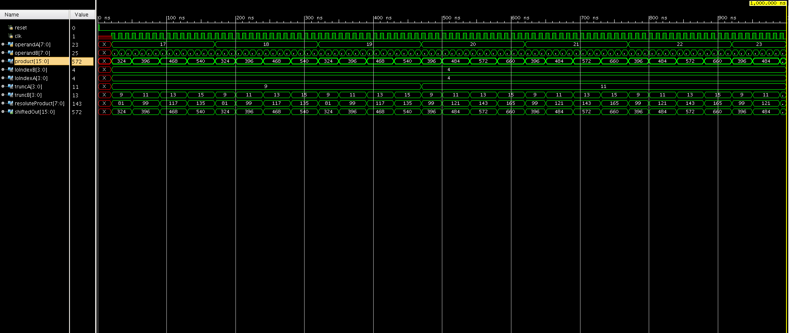
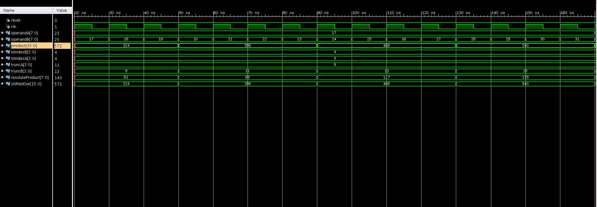

# drum
Dynamic Range Unbiased Multiplier

# Design

## approxMultiplier (top module)
The operands A and B are fed to the approxMultiplier module, which truncates the required number of bits and pushes it to the 4-bit Wallace Tree Multiplier.  
The output of the Wallace Multiplier (resoluteProduct) is then sent through the barrel shifter to obtain a compensated result (approx product).  
The shift of the resoluteProduct is necessary to compensate for the offset, which can be calculated by: 

```
<-----n bits---->
|0|0|1|X|...|X|X|
    <---t bits-->
    <-k bits->
```

In the paper's terms, t-k bits need to be shifted for each operand, which results in
`loIndexA+1 + loIndexB+1 - 2*(MAIN_RESOLUTION)` for the program.

Shift amount wouldn't cross beyond log(OUT\_WIDTH) and is an assumption made for the hardware of the barrelShifter.


## Wallace-Tree Multiplier

* Is the only solution to a scaled 16x16 multiplier hardcoded logic?
* Instantiate 4-bit wallace-multipliers 8x8, 16x16 wallace multipliers?
* Testbench needed

## Leading One Detector

LOD is implemented along with a simple MSB to LSB priority encoder.  
Naturally, a `break` statement will be necessary for prioritising the MSB, which isn't synthesizable, hence a basic FSM is used to improvise.


# Simulation Reults

The figure below shows `operandA` and `operandB` looping from 17 to 31 (decimal).  


  
  
The figure below shows one iteration of the testbench's outer loop, with `operandA` fixed at 17 and `operandB` ramping from 17 to 31.  

